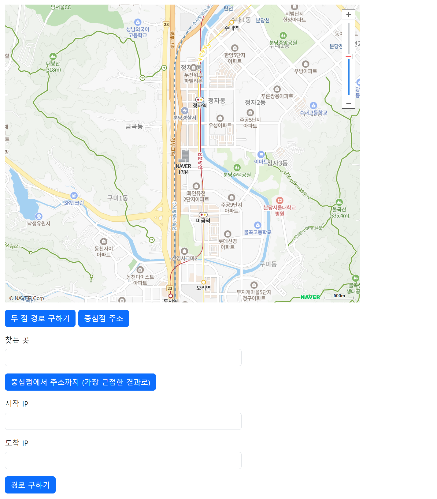

# 🤓요구사항

- Skeleton 코드 : 4개의 Handler Method

- 각 기능을 NCP의 API를 활용하여 완성하는 것이 목표이다.
(두 점 경로 구하기, 중심점 주소, 중심점에서 주소까지, 이동경로 구하기)

#### 1) 두 점 경로 구하기 : withPoints() / 두 점의 정보를 입력받아 그 사이의 이동경로를 반환.

#### 2) 중심점 주소 : getAddress() / 하나의 좌표를 입력받아 주소를 반환. (alert로 주소를 반환)

#### 3) 중심점에서 주소까지 : withQuery() / 하나의 좌표와 검색 주소를 입력받아 좌표에서 주소검색 결과까지의 위치로 이동.

#### 4) 이동경로 구하기 : withIpAddress() / 두 IP 주소를 입력받아 그 사이의 이동경로를 반환. 시작 IP와 도착 IP 입력창의 내용이 전달.

## 활용할 것.
1) Directions 5 활용 : 출발지, 목적지 간의 경로에 대한 정보를 반환하는 API
2) Reverse Geocoding 활용 : 좌표를 입력받아, 주소 정보로 반환하는 API
3) Reverse Geocoding + GeoCoding(주소 검색어를 입력받아 상세 주소와 좌표를 응답하는 API) + Direction 5
4) GeoLocation : IP를 입력받아 위치 정보를 반환하는 API

